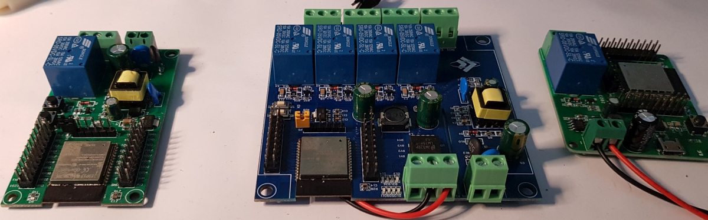
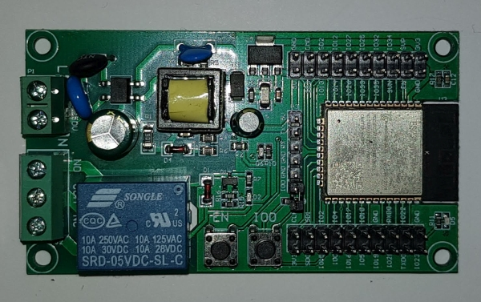
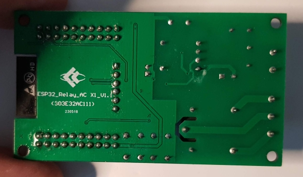
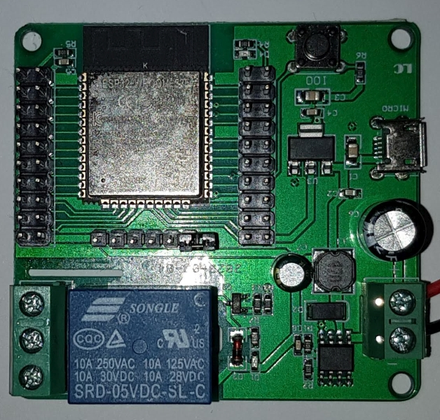
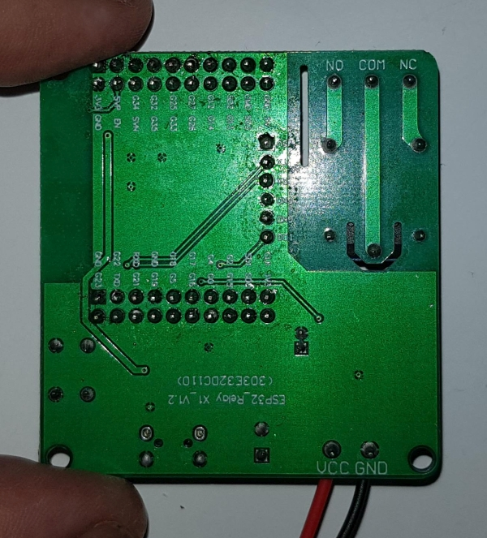
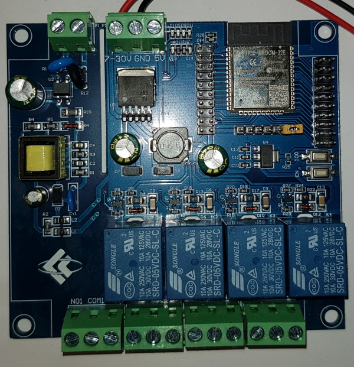
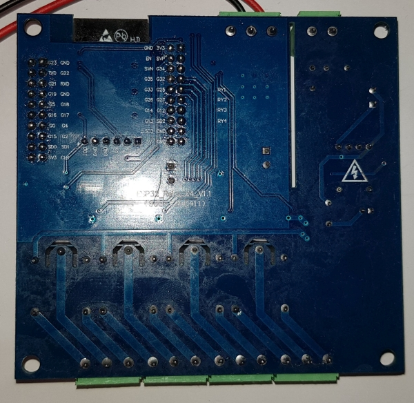

# ESP32nRelayBoard
Test programm for relay boards with an ESP32 from the quick Ali ;)

## One Relay Version

## Two Relay Version
I have no own board for that

## Four Relay Version 

## Eight Relay Version 
I have no own board for that